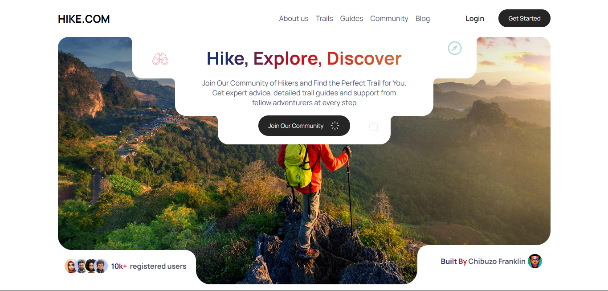

# HIKE.COM Landing page design

*The final product after development*

*The design I implemented*

**[Live Site](https://franklivania-hike.netlify.app/)**

If you want the design, you can download from here, or you can go to twitter to get [the design](https://x.com/Ayomide0_/status/1819795337344921988). Also remember to give her accolades to her.

### Issues I faced

The major issues I faced was finding resources and making the circular stuff like she did. Welp, CSS does a lot of magic, I'll tell you that, but... But... You must sweat

> You must sweat

So, I scoured the internet looking for images, icons, font (How I knew the font... Just watch the video)

### How I built it

I used 

* HTML
* CSS

to build this beautiful landing page design, and I learned a lot during the process. I mean, you think you know a lot about what you use for everyday work, and you discover you know nothing.

Plus, I have been exposed to a lot of tools and materials.
Imagine getting it all with no hint other than a picture design

> Google is a skill. A goated one!

You should know how to utilise things at hand. And devs, as you try this, proceed to add *Learn FIGMA* to you todo list. In the future, you would find it interesting

## Conclusion

It is a very interesting project. Props to [Mercy Asuquo](https://www.behance.net/mercyasuquo2#) for this interesting challenge. Hopefully your devs do not suffer
